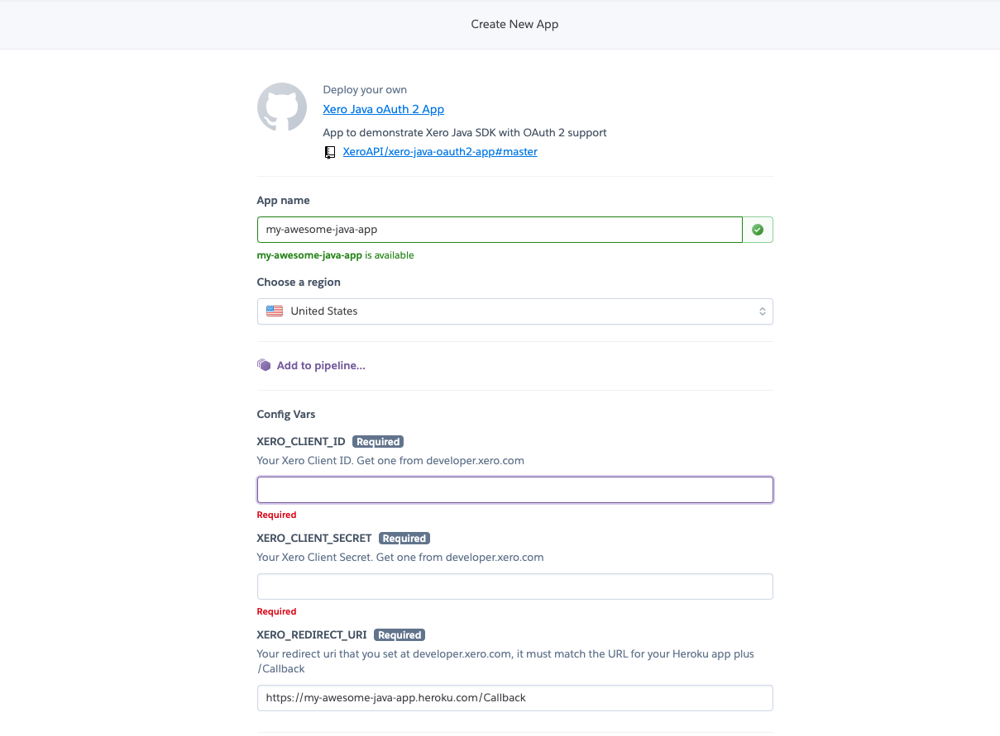
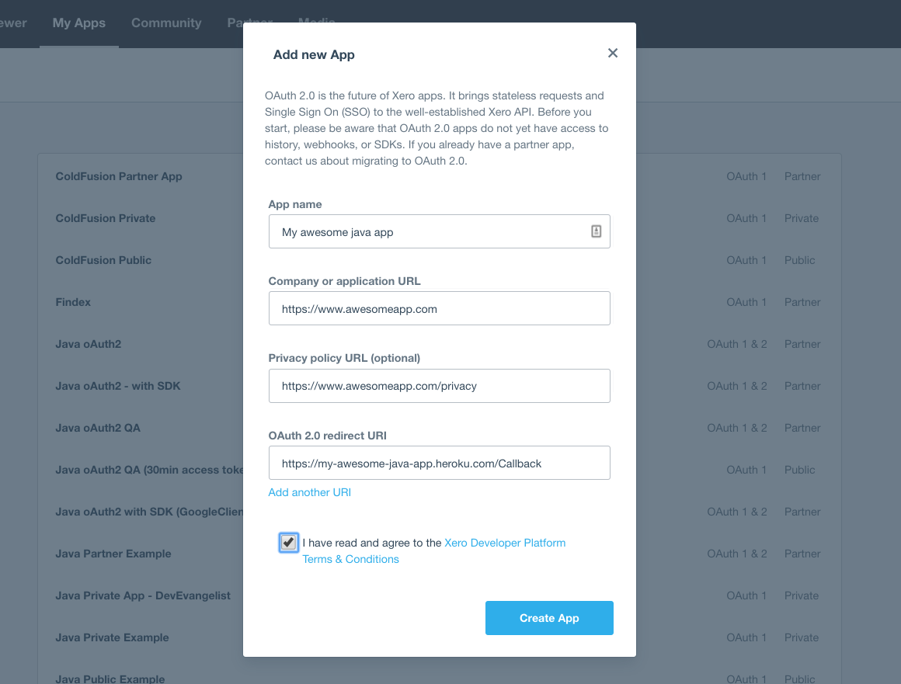
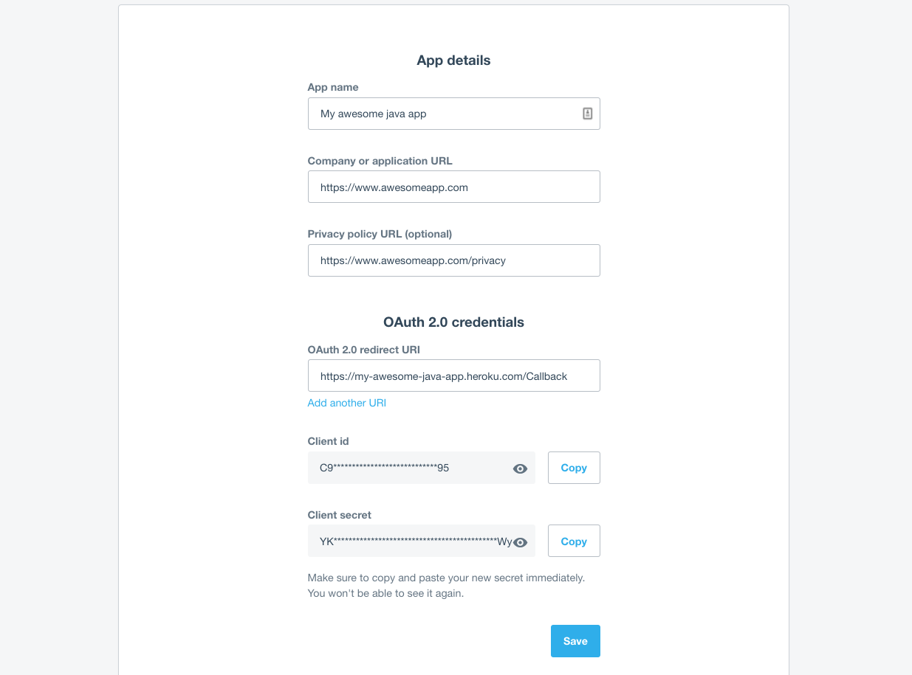
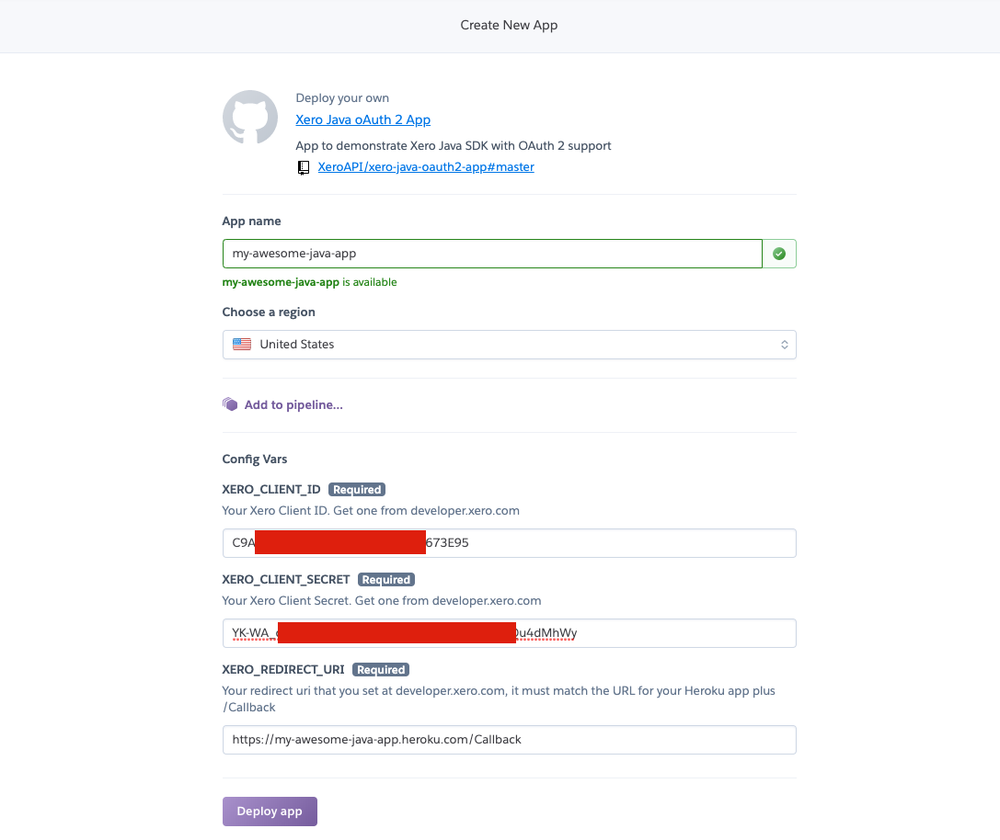
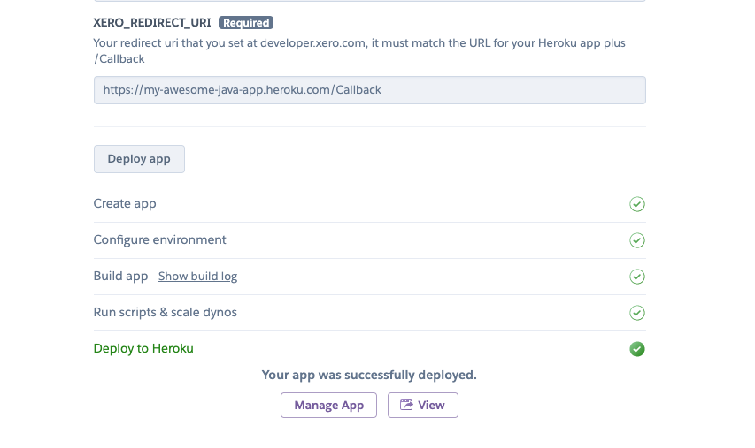

# Xero Java oAuth2 App
This java project demonstrates how to use the Xero-Java SDK.  Clone this repository to your local machine to begin.

Note: this project was built & tested using [Eclipse](https://www.eclipse.org/downloads/) and [Tomcat 8.x server](http://tomcat.apache.org/)

## Depoloy to Heroku
Don't have a Heroku account, you can [create one for free](https://signup.heroku.com/).

### Click to deploy this app to Heroku
[](https://heroku.com/deploy?template=https://github.com/XeroAPI/xero-java-oauth2-app/tree/master)

Give your new Heroku app a name.


Notice, your redirectUri will include the name of your app.

### Create oAuth 2 app in Xero.
To obtain your *XERO_CLIENT_ID and XERO_CLIENT_SECRET*, follow these steps and create a Xero app

* Create a [free Xero user account](https://www.xero.com/us/signup/api/) (if you don't have one)
* Login to [Xero developer center](https://developer.xero.com/myapps)
* Click "Try oAuth2" link
* Enter your App name, company url, privacy policy url.
* Enter the redirect URI (this is your callback url - https://youappname.heroku.com/Callback)
* Agree to terms and condition and click "Create App".



* Click "Generate a secret" button.



### Complete New App on Heroku
* Copy your client id and client secret to Heroku form AND save for use later.



### Save your Xero client secret
* At developer.xero.com - click the "Save" button. You secret is now hidden.


### Deploy your Heroku App
* Click the "Deploy App" button ... app will build and deploy
* Click the "view" button to launch your app in a browser.




## Import the project into Eclipse
To modify this code, clone or download the repository.

Then, in Eclipse, go to File > New > Java Working Set and create a working set called “Xero Java App" (or something appropriate).

Go to File > Import > General and select Existing Projects into Workspace.

Next to “Select root directory,” browse to the cloned repository on your computer where you downloaded all the files from Github. 

Then select Open and select the "Add projects to working set" check box, and then select the working set you created.

Click Finish.

## Create a Xero App
To obtain your API keys, follow these steps and create a Xero app

* Create a [free Xero user account](https://www.xero.com/us/signup/api/) (if you don't have one)
* Login to [Xero developer center](https://developer.xero.com/myapps)
* Click "Try oAuth2" link
* Enter your App name, company url, privacy policy url.
* Enter the redirect URI (this is your callback url - localhost, etc)
* Agree to terms and condition and click "Create App".
* Click "Generate a secret" button.
* Copy your client id and client secret and save for use later.
* Click the "Save" button. You secret is now hidden.

## Add your API keys to this app
You'll need to set the *clientId, clientSecret and redirectURI* in the following files

* Authorization.java
* Callback.java
* TokenRefresh.java

## Build and deploy
Compile your app and deploy to a server (tomcat, etc)
```sh
mvn clean install
```

Run on Tomcat

## License

This software is published under the [MIT License](http://en.wikipedia.org/wiki/MIT_License).

	Copyright (c) 2019 Xero Limited

	Permission is hereby granted, free of charge, to any person
	obtaining a copy of this software and associated documentation
	files (the "Software"), to deal in the Software without
	restriction, including without limitation the rights to use,
	copy, modify, merge, publish, distribute, sublicense, and/or sell
	copies of the Software, and to permit persons to whom the
	Software is furnished to do so, subject to the following
	conditions:

	The above copyright notice and this permission notice shall be
	included in all copies or substantial portions of the Software.

	THE SOFTWARE IS PROVIDED "AS IS", WITHOUT WARRANTY OF ANY KIND,
	EXPRESS OR IMPLIED, INCLUDING BUT NOT LIMITED TO THE WARRANTIES
	OF MERCHANTABILITY, FITNESS FOR A PARTICULAR PURPOSE AND
	NONINFRINGEMENT. IN NO EVENT SHALL THE AUTHORS OR COPYRIGHT
	HOLDERS BE LIABLE FOR ANY CLAIM, DAMAGES OR OTHER LIABILITY,
	WHETHER IN AN ACTION OF CONTRACT, TORT OR OTHERWISE, ARISING
	FROM, OUT OF OR IN CONNECTION WITH THE SOFTWARE OR THE USE OR
	OTHER DEALINGS IN THE SOFTWARE.


